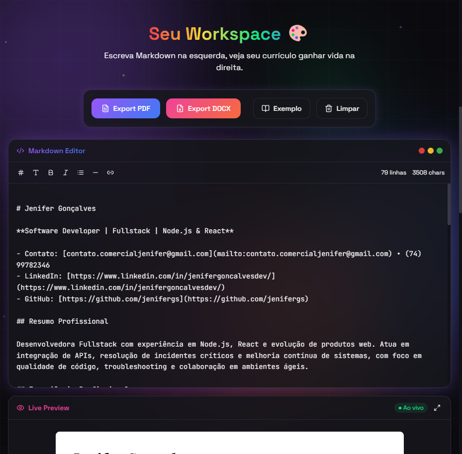
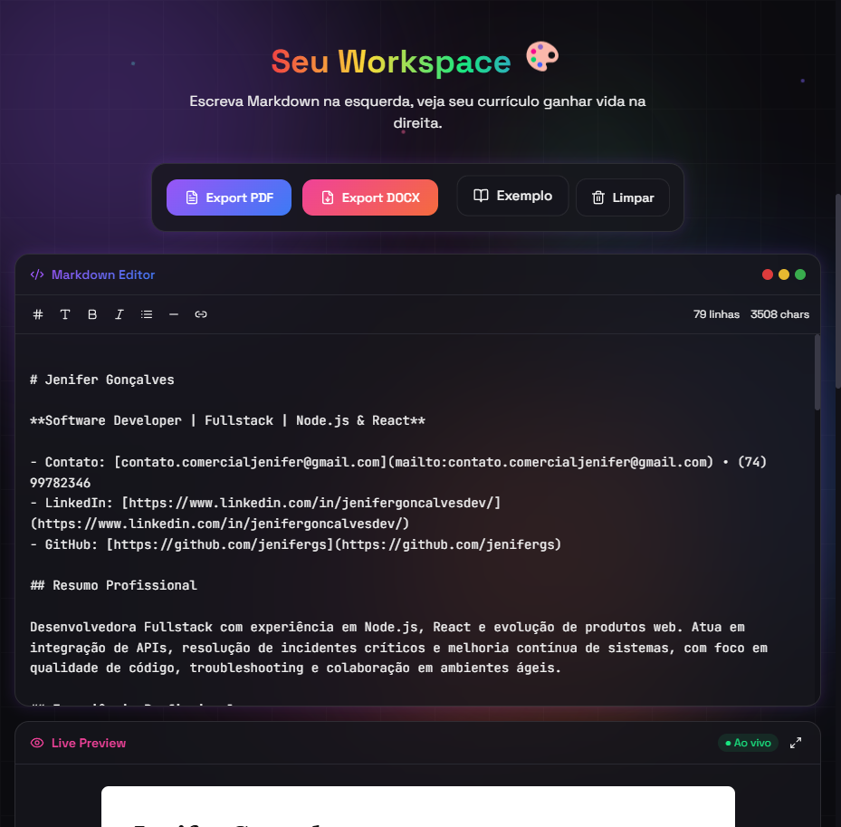

# curriculum-vinext

> Editor de currículo em Markdown com exportação para PDF e DOCX — rápido, elegante e sem banco de dados.


---

## ✨ Funcionalidades

- **Editor Markdown** ao vivo com preview sincronizado
- **Exportação PDF** via `html2canvas` + `jsPDF`
- **Exportação DOCX** via `docx` + `file-saver`
- Exemplo de currículo pré-carregado para começar rápido
- Animações suaves com **Framer Motion**
- UI 100% responsiva com **Tailwind CSS**
- Confetti ao exportar 🎉

---

## 📸 Screenshots

### Tela Inicial


### Workspace — Editor + Preview



### Exportação



---

## 🚀 Tecnologias

| Categoria | Tecnologia                                 |
| --------- | ------------------------------------------ |
| Framework | React 19 + TypeScript                      |
| Build     | Vite 6                                     |
| Estilos   | Tailwind CSS 3 + `@tailwindcss/typography` |
| Animações | Framer Motion                              |
| Markdown  | `react-markdown` + `remark-gfm`            |
| PDF       | `html2canvas` + `jsPDF`                    |
| DOCX      | `docx` + `file-saver`                      |
| Ícones    | `lucide-react`                             |

---

## 📦 Instalação

### Pré-requisitos

- [Node.js](https://nodejs.org/) >= 18
- [pnpm](https://pnpm.io/) >= 9

### Passos

```bash
# Clone o repositório
git clone https://github.com/seu-usuario/curriculum-vinext.git
cd curriculum-vinext

# Instale as dependências
pnpm install

# Inicie o servidor de desenvolvimento
pnpm dev
```

Acesse `http://localhost:5173` no navegador.

---

## 🛠️ Scripts

| Comando           | Descrição                            |
| ----------------- | ------------------------------------ |
| `pnpm dev`        | Inicia o servidor de desenvolvimento |
| `pnpm build`      | Build de produção                    |
| `pnpm preview`    | Serve o build localmente             |
| `pnpm build:prod` | Build com mode production explícito  |
| `pnpm start:prod` | Serve o build em `0.0.0.0:4173`      |

---

## 🐳 Docker

```bash
# Build da imagem
docker build -t curriculum-vinext .

# Rodar o container
docker run -p 4173:4173 curriculum-vinext
```

Acesse `http://localhost:4173`.

---

## 📁 Estrutura do Projeto

```
src/
├── App.tsx                  # Componente raiz
├── main.tsx                 # Entry point
├── globals.css              # Estilos globais / variáveis CSS
└── components/
│   ├── ActionBar.tsx        # Botões de exportação e ações
│   ├── BackgroundOrbs.tsx   # Orbs decorativos animados
│   ├── Confetti.tsx         # Efeito confetti pós-exportação
│   ├── HeroSection.tsx      # Seção hero da landing page
│   ├── MarkdownEditor.tsx   # Textarea do editor Markdown
│   ├── ResumePreview.tsx    # Preview renderizado do currículo
│   └── ResumeWorkspace.tsx  # Layout editor + preview
└── lib/
    ├── exportDocx.ts        # Lógica de exportação DOCX
    ├── exportPdf.ts         # Lógica de exportação PDF
    └── sampleResume.ts      # Currículo de exemplo
```

---

## 📄 Licença

MIT
